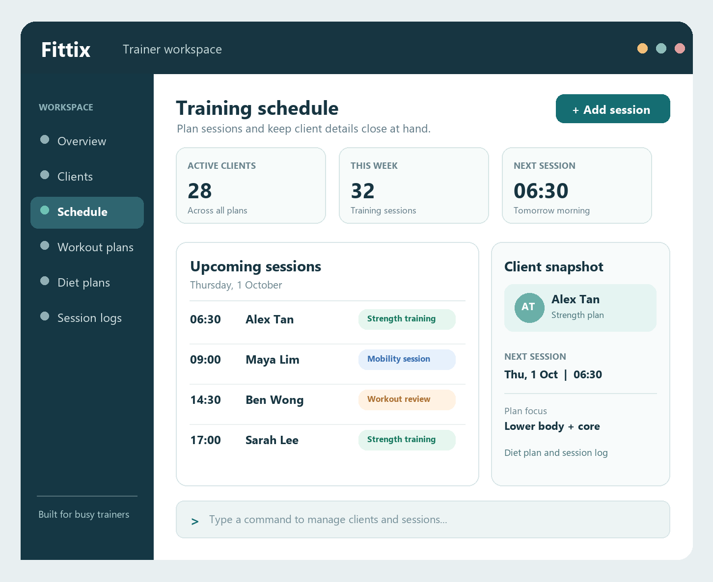

# Fittix

Fittix is a desktop application for gym trainers to manage their clients and training work in one place. It is designed for trainers who need quick access to client information between sessions and prefer a command-driven workflow.

The planned product brings together:

* Client contact details and training schedules
* Workout and diet plans for each client
* Logs of completed workout sessions, including exercises, weights, sets, and repetitions

The image above is a mockup of the intended interface. The application is being developed incrementally, so the current build may look different.

For more information, see the [Fittix project website](https://ay2627s1-cs2103t-t14-1.github.io/tp/), including the User Guide, Developer Guide, and team page.

This project is based on the AddressBook Level 3 project created by the [SE-EDU initiative](https://se-education.org).
