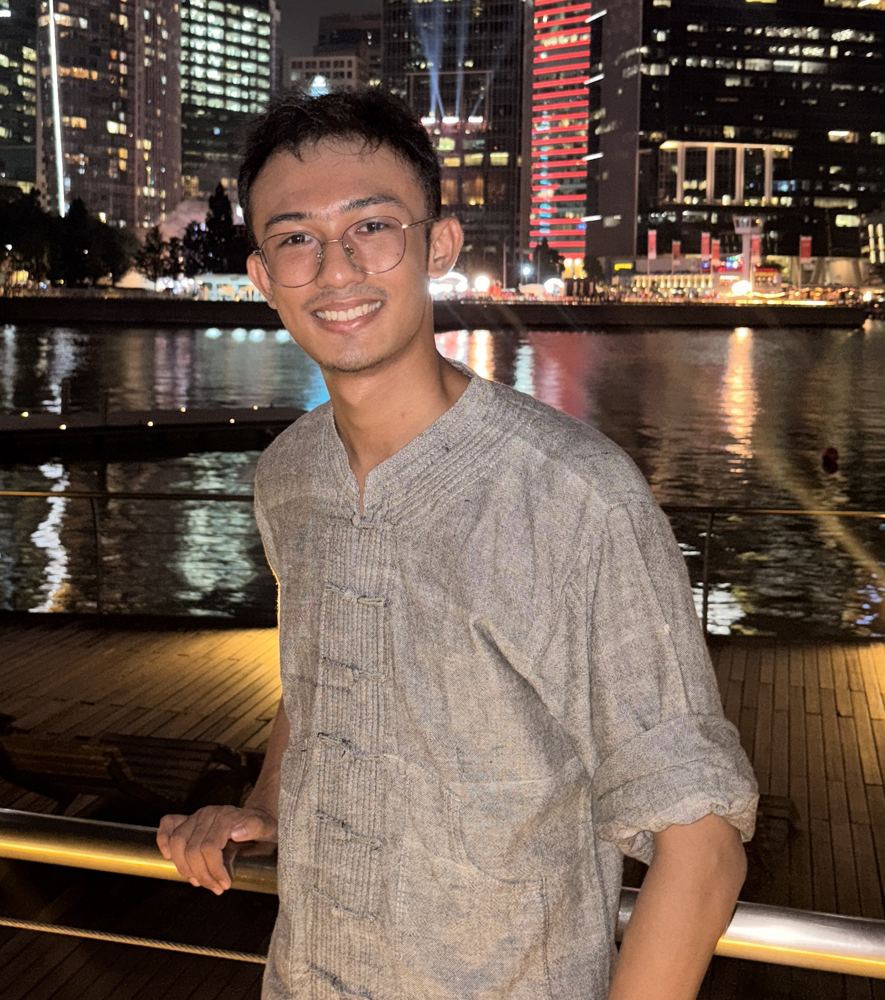
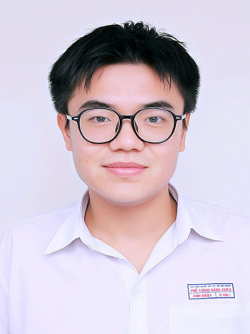
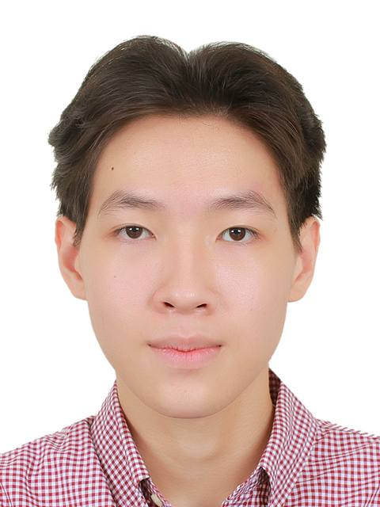
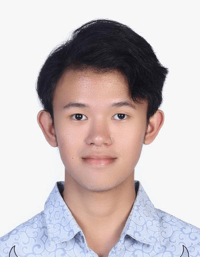
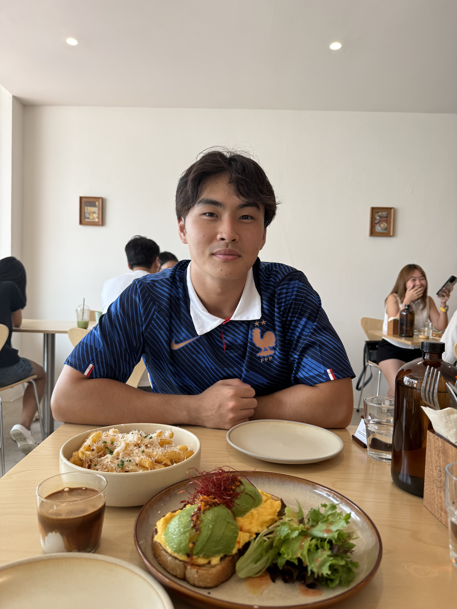

We are a team based in the [School of Computing, National University of Singapore](https://www.comp.nus.edu.sg).

You can reach us at the email `seer[at]comp.nus.edu.sg`

## Project team

### Win Htut Khaung Soe

[[homepage](https://winhks25.github.io/winhtutkhaungsoe/)]
[[github](https://github.com/winhks25)]

* Role: Project Lead

### Dao Anh Khoa

[[homepage](https://www.linkedin.com/in/anhkhoadao/)]
[[github](https://github.com/itzkhoadao)]

* Role: Developer
* Responsibilities: Diet plan management

### Pham Doan Gia Hien

[[github](https://github.com/HienPahm)]

* Role: Developer
* Responsibilities: Training schedule management

### Frederico Samuel Halim

[[github](http://github.com/fikoww)]

* Role: Developer
* Responsibilities: Workout session logging
* 
### Zhang Kaiwen

[[github](https://github.com/zkw2004)]
[[portfolio](team/johndoe.md)]

* Role: Developer
* Responsibilities: UI
